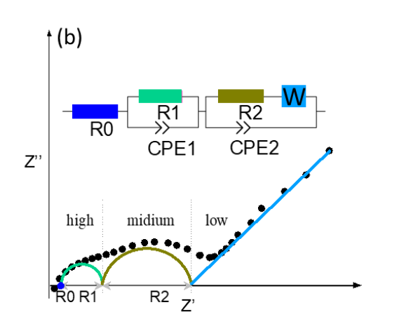
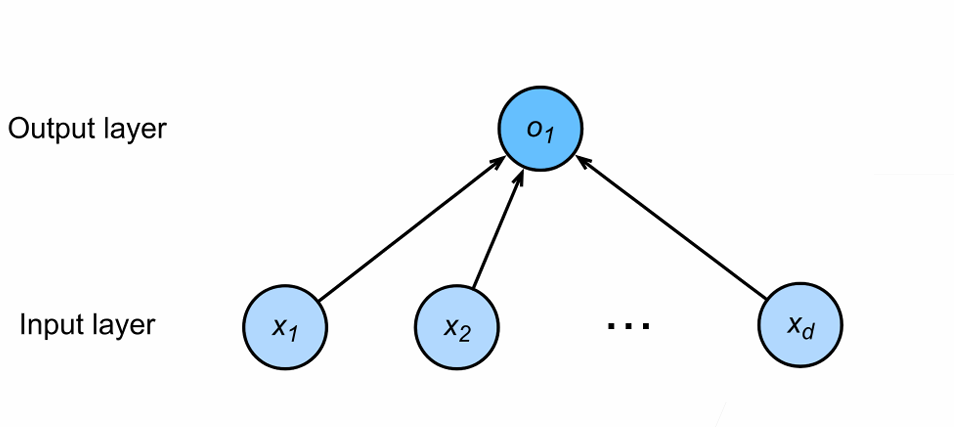

# EIS预测SOH
## 数据介绍
1. Excel 中的“CYX_Y_Z”这一名称与正文中的“CYX-X/Z”相对应。
2. 由于并非所有的循环通道都具备 EIS 功能，因此在本研究中，我们从每种循环条件下选取一个具有代表性的电池单元来进行 EIS 讨论。所选的 NCA 电池单元为：CY25-025_1-#4（适用于 CY25_0.25_1）；CY25-05_1-#11（适用于 CY25_0.5_1）；CY25-1_1-#5（适用于 CY25_1_1）；CY35-05_1-#1（适用于 CY35_0.5_1）；CY45-05_1-#13（适用于 CY45_0.5_1）；
所选的 NCM 电池单元为：#CY25-05_1-#16（适用于 CY25_0.5_1）；CY35-05_1-#2（适用于 CY35_0.5_1）；CY45-05_1-#2（适用于 CY45_0.5_1）；
所选的 NCM+NCA 电池单元为：CY25-05_1-#1（适用于 CY25_0.5_1）；CY25-05_2-#1（适用于 CY25_0.5_2）；CY25-05_4-#2（适用于 CY45_0.5_4）；
3. 在每个 Excel 表格中，工作表分别命名为 X、X_1RCPE 和 X_2RCPE，其中 X 表示循环次数。X 和 X_2RCPE 表示使用了补充图 8 中所示的 ECM 进行拟合。X_1RCPE 表示未使用 R1//CPE1（补充图 8b）进行数据拟合。循环次数 X 可通过以下公式与补充表 12 中的循环对应起来：
NCA 电池：循环次数 = (X - 1) * 25；NCM 电池：循环次数 = (X - 1) * 50；NCM+NCA 电池：循环次数 = (X - 1) * 50；4）原始阻抗数据与拟合阻抗数据之间的拟合系数（R2）已在补充表 12 中进行了汇总。
## data.ipynb介绍
里面包含数据导入的方式，以及作图方式（仅作示例）

## model1.ipynb介绍
1. 导入EIS数据对ECM参数进行拟合
2. 输入：单个EIS数据/多个EIS数据（可选）
3. 输出：单个ECM参数/多个ECM参数

## model2.ipynb介绍
1. 由多个由单个ECM参数及其对应标签y(SOH或者充放电循环次数)组成的数据对神经网络训练
2. 接受单个ECM参数，输出预测标签y

